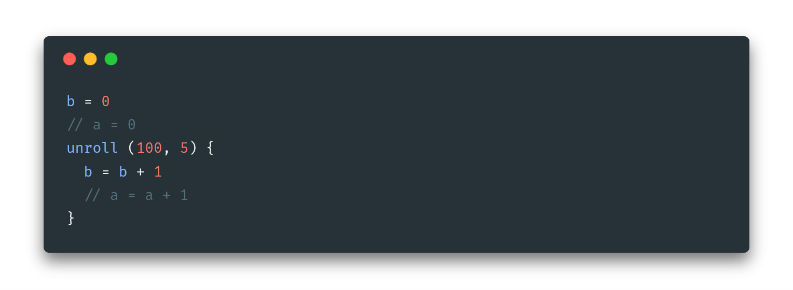
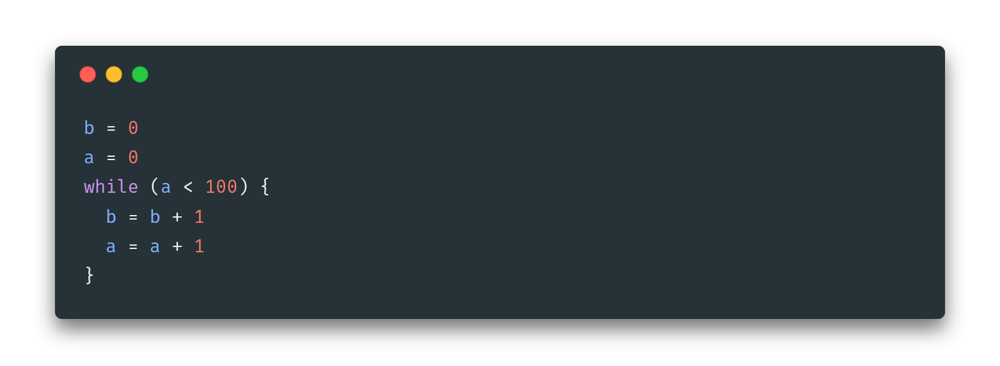
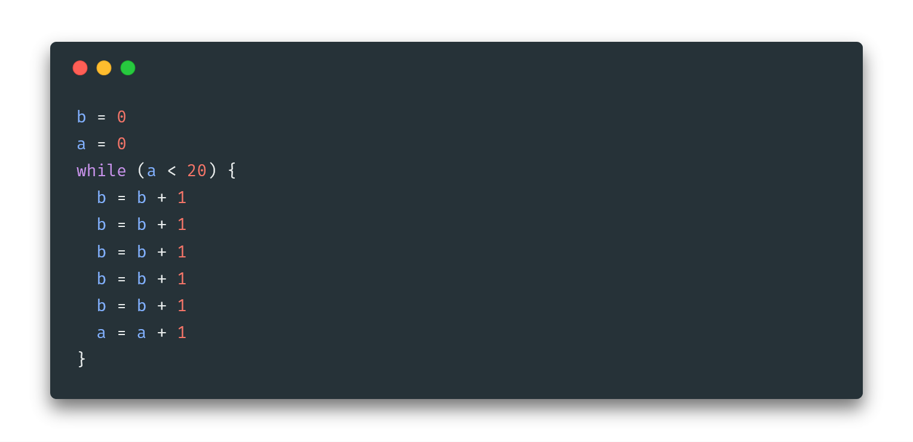
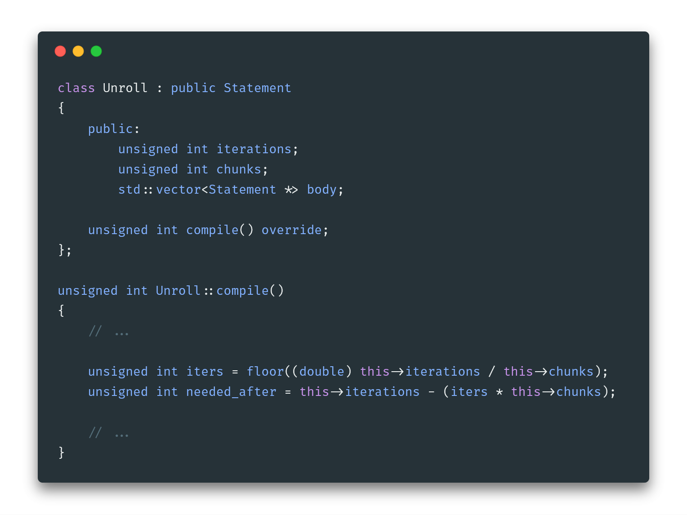
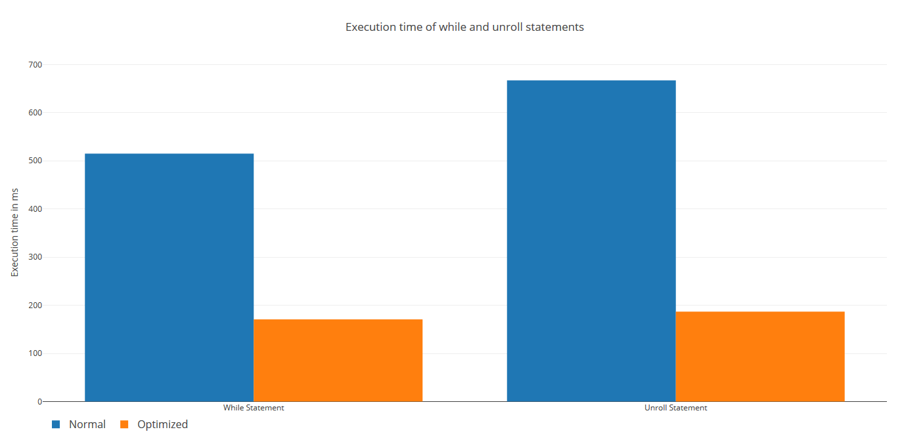
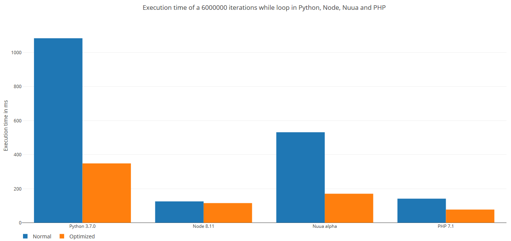

# Introduction

In this paper I'll argue and develop an alternative to the typical `while` loops found in programming languages.
This aproach will focus on optimizing the speed of the result while commenting the ups and downs of the techique.

This feature is part of the Nuua programming language, a language I'm developing as the bachelor thesis. Thus it's
planned for a 2019 release, most of the language is already done and this work will explain how I implemented a
system for cases when you want to do a loop of N iterations where N is a constant number. Keep in mind this is a prototype
for the final language and needs much more further investigation towards the final release.

# The unrolling statement

The alternative to this `while` loop is called `unrolling`. This statement is called with two arguments. The first one
indicates the number of constant iterations to be done, and the second indicates the chunks in wich the iterations will be broken
with. As an example, take a look into the following code:


This code will break the N iterations into C chunks of code. The example have `N = 100` and `C = 5`. The final result will
make `100 / 5 = 20` iterations instead of 100. Each iteration will then have the equivalence of `5` bodies of the unrolling
statement. As a comparison side by side with the while statement the following two images states the same results without
applying any changes to the `while` statement. The `while` statement will make `100` iterations while the `unroll` will make `20`





Since this code does not really represent the optimization applied to the while statement, the following one is the exact equivalence
of the `while` statement when we apply the `unroll`:



All theese codes output the same result of `b` but ofter, the jumps between the opcodes represent a change in the program counter
and a re-evaluation of the condition. While this is not a bad practice, compilers tend to optimize them using a techique called
loop unrolling. `unroll` does this for a constant number of iterations as it's faster to generate the output code for it.

## Generated bytecode

Let's dig into the bytecode that all these codes output. These bytecode corresponds to the nuua's virtual machine. It's basically
a stack based machine so the operations will feel common.

The first example; where we `unroll(100, 5)` with the body of `b = b + 1` we get the following output:

\newpage

```
// Initial b = 0 statement
OP_CONSTANT 0.000000
OP_STORE b

// We first save the loop variable, it's basically an auto-generated one.
OP_CONSTANT 0.000000
OP_STORE _nuua_4

// The loop starts here
// We make the comparison to see if we still have iterations to be done
// The number of iterations is 100 / 5 = 20
// I'll later discuss what happens if a decimal number is encountred in this division.
OP_LOAD _nuua_4
OP_CONSTANT 20.000000
OP_LT
OP_BRANCH_FALSE 45.000000

// The body of the unrwoll starts here and it's done 5 times
OP_LOAD b
OP_CONSTANT 1.000000
OP_ADD
OP_STORE b

OP_LOAD b
OP_CONSTANT 1.000000
OP_ADD
OP_STORE b

OP_LOAD b
OP_CONSTANT 1.000000
OP_ADD
OP_STORE b

OP_LOAD b
OP_CONSTANT 1.000000
OP_ADD
OP_STORE b

OP_LOAD b
OP_CONSTANT 1.000000
OP_ADD
OP_STORE b

// We now add 1 to the temp variable that holds the number of iterations done.
OP_LOAD _nuua_4
OP_CONSTANT 1.000000
OP_ADD
OP_STORE _nuua_4

// We go back to the start and re-check the condition
OP_RJUMP -50.000000
```

\newpage

Although this is quite long, the idea behind it it's clear. The body of the unroll is done 100 times but in 20 iterations.
Let's now look at the generated code for the normal while statement.

```
// Initial b = 0 and a = 0 setup
OP_CONSTANT 0.000000
OP_STORE b
OP_CONSTANT 0.000000
OP_STORE a

// The loop starts here
// It checkes if a < 100
OP_LOAD a
OP_CONSTANT 100.000000
OP_LT
OP_BRANCH_FALSE 17.000000

// The body starts here
OP_LOAD b
OP_CONSTANT 1.000000
OP_ADD
OP_STORE b
OP_LOAD a
OP_CONSTANT 1.000000
OP_ADD
OP_STORE a

// Get back to the top
OP_RJUMP -22.000000
```

What we can see here is that the code is smaller but it does 100 iterations. I won't paste the equivalent code
of the optimized while since it just repeats the `b = b + 1` operation 5 times and reduces the loop to 20 iterations.
so the code does not change much but the result do.

# Implementation

Although the implementation is quite complex as it touches parts of all the nuua's compiler, I'll discuss the basics of it.
The implementation is done in C++.

Basically, the first thing to do is to calculate the number of full iterations that need to be done at compile time.
This number will be equal or lower than the total iterations `N`. It will be equal to `N` if the division have no
remainder, for instance, the example provided `unroll(100 / 5)` have a reminder or `0` and it can fit 20 iterations with 5 bodies inside.

However, when the user's input is for example `unroll(3, 2)` the unroll statement is unable to fit `3 / 2 = 1.5` iterations with 2 bodies inside, since this is not an integer the solution is to floor the number obtained. Following the example provided, we floor
the value `floor(1.5) = 1` and then we calculate how many bodies will need to be added after the main iterations (`1` in this case).

The following code is a placeholder to see how this is calculated



The compilation details are not described here since it's not the purpose of this work. However, at the end of this
document I'll add a reference to check the whole code in action.

What happens then, if the following example is used, the output bytecode is the following:

```
// b = 0
OP_CONSTANT 0.000000
OP_STORE b

// Unroll preparation
OP_CONSTANT 0.000000
OP_STORE _nuua_4

// While begins, evaulates the condition
OP_LOAD _nuua_4
OP_CONSTANT 1.000000
OP_LT
OP_BRANCH_FALSE 24.000000

// The body of the unroll begins here
OP_LOAD b
OP_CONSTANT 1.000000
OP_ADD
OP_STORE b

OP_LOAD b
OP_CONSTANT 1.000000
OP_ADD
OP_STORE b

// Increment the numbers of iterations done
OP_LOAD _nuua_4
OP_CONSTANT 1.000000
OP_ADD
OP_STORE _nuua_4

// Jump back up
OP_RJUMP -29.000000

// The remaining operations that needed to be done are done after the loop
OP_LOAD b
OP_CONSTANT 1.000000
OP_ADD
OP_STORE b
```

# Benchmarks

To discuss the result we'll run the same code with 6000000 iterations in diferent situations. The following results are calculated
in the same machine and althought they may vary depending on the operating system and hardware, they show the main idea behind it.

## Execution time

### 6000000 while iterations

| Test number | Execution time |
| ----------- | -------------- |
| 1           | 0.550 s        |
| 2           | 0.496 s        |
| 3           | 0.514 s        |
| 4           | 0.519 s        |
| 5           | 0.498 s        |
| **Median**  | **0.515 s**    |

### 6000000, 1 unrwoll iterations

| Test number | Execution time |
| ----------- | -------------- |
| 1           | 0.673 s        |
| 2           | 0.665 s        |
| 3           | 0.668 s        |
| 4           | 0.666 s        |
| 5           | 0.665 s        |
| **Median**  | **0.667 s**    |

### 6000000, 20 unrwoll iterations

| Test number | Execution time |
| ----------- | -------------- |
| 1           | 0.190 s        |
| 2           | 0.185 s        |
| 3           | 0.185 s        |
| 4           | 0.188 s        |
| 5           | 0.189 s        |
| **Median**  | **0.187 s**    |

### 6000000 manually optimized while iterations

| Test number | Execution time |
| ----------- | -------------- |
| 1           | 0.171 s        |
| 2           | 0.170 s        |
| 3           | 0.172 s        |
| 4           | 0.171 s        |
| 5           | 0.172 s        |
| **Median**  | **0.171 s**    |

## Graphical result

This is the result obtained from both, the while and the unroll statements.



To compare the execution time to other programming languages, I'll benchmark Python, Node (Javascript), Nuua and PHP
with the normal 6000000 iterations while statement. It will also benchmark the same languages and code when manual optimization
is applied to the while statement. This also breaks down what language is better at automatically optimizing the code.



# Conclusions

Although we have some clear winners, beating a programming language is very hard. Specially if they are interpreted and they've been out there for a very long time. I still can't guess why python is underperforming.

However, the performance I'm getting with Nuua still makes me very happy and competitive. At least with the current setup.

Talking about the unroll statement, it looks it's a bit under-performant at the moment, but as it can be further optimized, it makes
sense to use it instead of manually copy-pasting 20 chunks of code and mandually reducing the number of loops.

I still need to learn more about this sort of optimizations but the results are already promising.